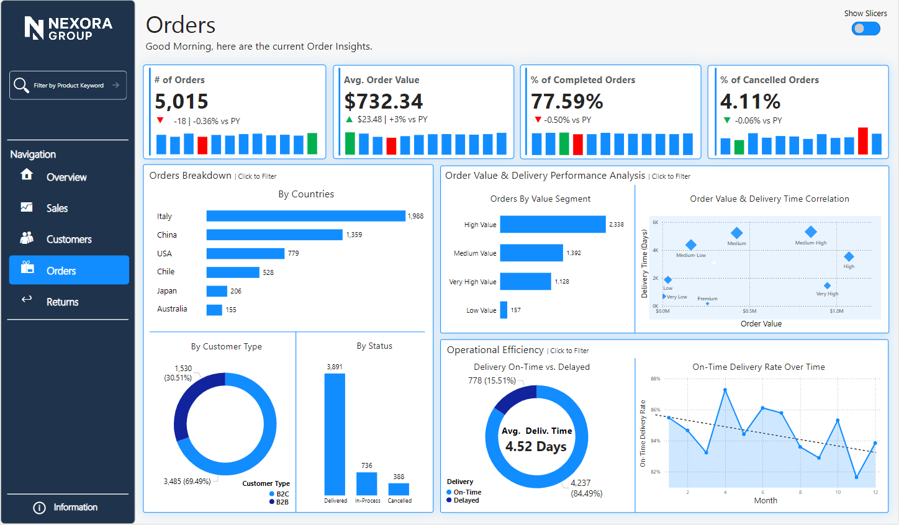

# Power BI Performance Dashboard

Ein interaktives **End-to-End Business Performance Dashboard** in **Power BI**, entwickelt zur Analyse von **Verkäufen, Kunden, Bestellungen und Rücksendungen** über Regionen, Kanäle und Zeiträume hinweg.

Das Dashboard konzentriert sich auf **Executive KPIs**, **operative Einblicke** und **Treiberanalysen** mit einer app-ähnlichen Benutzererfahrung (Fokusmodus, Navigation und Datenschnitt-Umschaltung).

---

## 📋 Inhaltsverzeichnis

- [Projektübersicht & Status](#-projektübersicht--status)
- [Schnellstart](#-schnellstart)
- [Dashboard-Walkthrough](#-dashboard-walkthrough-demo)
- [Hauptfunktionen](#-hauptfunktionen)
- [Dashboard-Seiten](#-dashboard-seiten-übersicht)
- [Daten & Modell](#-daten--modell)
- [Dokumentation](#-dokumentation)
- [Tools & Technologien](#-tools--technologien)
- [Design-Hinweise](#-design-hinweise)

---

## 🚀 Projektübersicht & Status

### 📦 Repository-Evolution

**Dieses Repository ist eine umfassende Weiterentwicklung und Verbesserung eines früheren Repositories.**

Das ursprüngliche Repository ([archiviert in /legacy](legacy/)) enthielt ausschließlich die Power BI Dashboard-Datei ohne jegliche Entwickler-Ressourcen oder technische Dokumentation. Dieses verbesserte Repository erweitert das Projekt um professionelle Entwicklungstools, vollständige Dokumentation und extrahierte Daten für maximale Wiederverwendbarkeit und Zusammenarbeit.

### ✅ Was wurde verbessert und hinzugefügt

#### 📌 Vorheriges Repository (v1.0 - siehe [/legacy](legacy/))

Das ursprüngliche Repository war ein **einfaches Dashboard-Repository** mit minimaler Struktur:

```
legacy/
├── Performance Dashboard.pbix    # Nur die Dashboard-Datei
├── README.md                     # Minimales README ohne Details
├── Model.bim                     # Nur binäres Modell
├── assets/                       # Nur Screenshots
└── video/                        # Demo-Videos
```

**Einschränkungen des vorherigen Repositories:**
- ❌ **Keine Datenextraktion**: Daten waren nur in der PBIX-Datei eingebettet und nicht zugreifbar
- ❌ **Keine Dokumentation**: Kein Verständnis der Modellstruktur ohne Öffnen der PBIX
- ❌ **Keine Entwicklertools**: Keine Skripte zur Datenverarbeitung oder -extraktion
- ❌ **Keine Sicherheitsüberprüfung**: Code-Sicherheit nicht validiert
- ❌ **Keine Entwicklungsumgebung**: Kein DevContainer oder Setup-Anleitung
- ❌ **Begrenzte Wiederverwendbarkeit**: Schwierig, Daten oder Modell außerhalb von Power BI zu nutzen
- ❌ **Fehlendes technisches Wissen**: Neue Entwickler mussten Modell selbst analysieren
- ❌ **Inkonsistente Report-Struktur**: Es wurden verschiedene Canvas-Größen auf den Berichtsseiten verwendet. Zudem kamen mehrfach geschachtelte Objekte zum Einsatz, obwohl einfache „Karten"-Visuals (standardmäßig in Power BI enthalten) ausgereicht hätten – das erschwert die Weiterentwicklung erheblich

#### 🎯 Aktuelles Repository (v2.0 - Weiterentwicklung)

**Vollständig neu entwickeltes, professionelles Data-Analytics-Repository** mit allen Enterprise-Features:

```
PowerBI-Performance-Dashboard/        # ✨ Verbessertes Repository
├── .devcontainer/                    # ✨ NEU
│   └── devcontainer.json            # VS Code DevContainer-Konfiguration
├── assets/                          # ✓ Beibehalten (Screenshots)
├── data/                            # ✨ NEU: Extrahierte & verwendbare Daten
│   ├── README.md                    # Umfassende Extraktionsanleitungen
│   ├── dim_customer.csv             # 5.000 Kunden
│   ├── dim_date.csv                 # 1.096 Tage (2022-2024)
│   ├── dim_geography.csv            # 13 Länder, 3 Regionen
│   ├── dim_product.csv              # 160 Produkte, 4 Kategorien
│   ├── fact_orders.csv              # 99.801 Bestellungen
│   ├── fact_sales.csv               # 99.801 Verkaufstransaktionen
│   └── fact_returns.csv             # 3.007 Rücksendungen
├── doc/                             # ✨ NEU: Professionelle Dokumentation
│   ├── MODEL_DOKUMENTATION.md       # 482 Zeilen: Vollständige Modellarchitektur
│   ├── DATA_EXTRACTION_SUMMARY.md   # Extraktionsmethoden & Anleitungen
│   ├── SECURITY_SUMMARY.md          # Sicherheitsaudit & Best Practices
├── tools/                           # ✨ NEU: Entwickler-Werkzeuge
│   ├── generate_sample_data.py      # Beispieldaten-Generator
│   ├── extract_pbix_actual.py       # PBIX-Analyse-Tool
│   ├── extract_pbix_data.py         # Datenextraktions-Werkzeug
│   └── extract_actual_data.py       # .NET-basierte Extraktion
├── legacy/                          # ⚠️ Vorheriges Repository (v1.0 archiviert)
├── video/                           # ✓ Beibehalten
├── Model.bim                        # ✓ Beibehalten
├── README.md                        # ✨ Komplett überarbeitet (jetzt in Deutsch)
└── LICENSE                          # ✓ Beibehalten
```

### 🔄 Verbesserungen im Detail

#### 1️⃣ Datenextraktion & Zugriff ([/data](data/))

**Problem im vorherigen Repository**: Die Daten waren ausschließlich in der PBIX-Datei eingebettet und konnten nicht außerhalb von Power BI verwendet werden.

**Lösung**: Das aktuelle Repository stellt **7 CSV-Dateien im standardisierten Format** bereit, die insgesamt etwa 22 MB an Daten enthalten. Diese Dateien sind sofort einsatzbereit für verschiedene Analysen, Tests und Machine-Learning-Modelle. Das vollständige Datenschema ist detailliert in der [/data/DATA.md](data/DATA.md) dokumentiert. Darüber hinaus werden drei verschiedene Extraktionsmethoden beschrieben (DAX Studio, Tabular Editor und Power BI Desktop), sodass Nutzer die für sie passende Methode wählen können. Ein zusätzliches Python-Skript ermöglicht die automatische Regenerierung von Beispieldaten für Testzwecke.

#### 2️⃣ Umfassende technische Dokumentation ([/doc](doc/))

**Problem im vorherigen Repository**: Es existierte keine Modelldokumentation, sodass Entwickler das PBIX-Modell selbst analysieren mussten, um die Struktur zu verstehen.

**Lösung**: Das Repository bietet nun eine **umfassende Modell-Dokumentation** mit 482 Zeilen detaillierter Beschreibungen. Die Sternschema-Architektur ist vollständig dokumentiert, einschließlich aller 6 Faktentabellen (Sales, Orders, Returns, Visits, Return Amount, Financial Insights) und 6 Dimensionstabellen (Customer, Product, Date, Region, Channel, Return Reason). Alle Beziehungen zwischen den Tabellen, deren Kardinalitäten sowie DAX-Measures und Time-Intelligence-Berechnungen werden ausführlich erklärt. Visuelle Mermaid-Diagramme erleichtern das Verständnis der Modellstruktur, und Performance-Optimierungen sind ebenfalls dokumentiert.

Zusätzlich enthält die **[Extraktionsanleitung](doc/DATA_EXTRACTION_SUMMARY.md)** detaillierte Schritt-für-Schritt-Anleitungen für alle verfügbaren Tools sowie Erklärungen zu technischen Herausforderungen wie der XPress9-Kompression. Die **[Sicherheitsdokumentation](doc/SECURITY_SUMMARY.md)** bestätigt, dass alle Skripte einer vollständigen Code-Sicherheitsanalyse mit 6 verschiedenen Sicherheitsprüfungen unterzogen wurden. Es wurden keine Schwachstellen gefunden, und die Compliance mit Best Practices ist bestätigt.

#### 3️⃣ Entwickler-Tools & Automatisierung ([/tools](tools/))

**Problem im vorherigen Repository**: Es waren keinerlei Werkzeuge oder Skripte für Entwickler verfügbar.

**Lösung**: Das Repository enthält nun **4 spezialisierte Python-Skripte** für unterschiedliche Anwendungsfälle. Diese ermöglichen die automatische Generierung von realistischen Beispieldaten mit authentischen Business-Szenarien, die für Tests und Entwicklung genutzt werden können. PBIX-Analyse-Tools erleichtern die Extraktion von Metadaten aus Power BI-Dateien. Darüber hinaus sind mehrere Extraktionsansätze dokumentiert, sowohl Python-basiert als auch .NET-basiert, sodass Entwickler je nach technischer Umgebung die passende Methode wählen können.

#### 4️⃣ Entwicklungsumgebung & DevOps ([/.devcontainer](.devcontainer/))

**Problem im vorherigen Repository**: Es gab keine standardisierte Entwicklungsumgebung, was das Onboarding neuer Entwickler erschwerte.

**Lösung**: Eine vollständige **DevContainer-Konfiguration für Visual Studio Code** ist nun verfügbar. Diese enthält Python 3.11 mit allen notwendigen Abhängigkeiten vorinstalliert. Beim Start des Containers werden automatisch alle benötigten VS Code Extensions installiert, darunter Python, Pylance und Jupyter für die Entwicklung, Markdown-Tools für die Dokumentation, Git-Tools (Git Graph, GitLens) für die Versionskontrolle sowie Rainbow CSV für die komfortable Arbeit mit CSV-Dateien. Die gesamte Umgebung ist nach dem Container-Start sofort einsatzbereit, ohne dass manuelle Konfigurationsschritte erforderlich sind.


### 📊 Vorher/Nachher-Vergleich

| Kategorie | Vorheriges Repository (v1.0) | Aktuelles Repository (v2.0) | Verbesserung |
|-----------|------------------------------|------------------------------|--------------|
| **Daten** | Nur in PBIX eingebettet | ✅ 7 CSV-Dateien (22 MB) | Daten sind nun universell nutzbar für Python, R, SQL und Excel. Ermöglicht Analysen außerhalb von Power BI. |
| **Dokumentation** | 1 minimales README | ✅ 4 umfassende Dokumente (900+ Zeilen) | Vollständige technische Dokumentation beschleunigt Onboarding und reduziert Einarbeitungszeit erheblich. |
| **Entwicklertools** | 0 Skripte | ✅ 4 Python-Skripte | Automatisierung spart Entwicklungszeit und ermöglicht wiederholbare Prozesse für Datenextraktion und -generierung. |
| **Modellverständnis** | Nur durch PBIX öffnen | ✅ Vollständige Textdoku + Diagramme | Modellstruktur ist ohne Power BI Desktop einsehbar. Ermöglicht schnelle Analyse und Planung. |
| **Entwicklungsumgebung** | Manuelles Setup | ✅ DevContainer ready-to-use | Neue Entwickler sind innerhalb von Minuten produktiv statt Stunden. Konsistente Umgebung für alle Teammitglieder. |
| **Sicherheit** | Nicht überprüft | ✅ Vollständig auditiert | Erfüllt Enterprise-Compliance-Anforderungen. Reduziert Sicherheitsrisiken durch validierte Skripte. |
| **Wiederverwendbarkeit** | Begrenzt auf Power BI | ✅ Daten für Python, R, SQL, Excel | Maximale Flexibilität für unterschiedliche Analysewerkzeuge und Workflows. Daten können in verschiedenen Kontexten genutzt werden. |
| **Onboarding** | Schwierig, zeitaufwändig | ✅ Einfach durch Dokumentation | Neue Teammitglieder verstehen Projekt schneller. Reduziert Schulungsaufwand und Abhängigkeit von Experten. |
| **Dateigröße** | ~50 MB (nur PBIX) | ~72 MB (mit allem) | Minimaler zusätzlicher Speicherbedarf für massiv erweiterte Funktionalität. Hervorragendes Kosten-Nutzen-Verhältnis. |

### 🎯 Zielgruppen-Nutzen

**Für Entwickler:**

Dieses Repository bietet Entwicklern direkten Zugriff auf strukturierte CSV-Daten, die für Python- und R-Analysen verwendet werden können. Die vorbereitete DevContainer-Umgebung ermöglicht einen sofortigen Start ohne manuelle Konfiguration. Alle bereitgestellten Skripte können als Vorlagen für eigene Projekte wiederverwendet werden.

**Für Analysten:**

Business-Analysten erhalten eine vollständige Übersicht der Modellstruktur, ohne die PBIX-Datei öffnen zu müssen. Die detaillierten Datenextraktionsanleitungen können direkt auf eigene Power BI-Projekte angewendet werden. Alle DAX-Measures sind dokumentiert und nachvollziehbar erklärt.

**Für Data Scientists:**

Data Scientists finden strukturierte CSV-Daten vor, die sofort für Machine-Learning-Modelle genutzt werden können. Die realistischen Beispieldaten eignen sich hervorragend zum Testen von Algorithmen und Modellen. Die umfassende Schema-Dokumentation erleichtert das Feature-Engineering und die Datenaufbereitung.

**Für Projektmanager:**

Projektmanager profitieren von einem vollständigen Sicherheitsaudit, das Compliance-Anforderungen erfüllt. Die technische Dokumentation ist umfassend und erleichtert die Projektplanung und das Stakeholder-Management. Die klare Projektstruktur ermöglicht eine effiziente Ressourcenplanung und Teamkoordination.

### 📂 Legacy-Archiv

Das **vorherige Repository** ist vollständig im [/legacy](legacy/) Verzeichnis archiviert und dient als Referenz für:
- Vergleich der Projekt-Evolution
- Historische Nachvollziehbarkeit
- Backup der ursprünglichen Struktur

---

## 🚀 Schnellstart

### Für Anwender (Bericht ansehen)
1. **Repository klonen oder herunterladen**:
   ```bash
   git clone https://github.com/your-username/PowerBI-Performance-Dashboard.git
   ```
2. **Projekt öffnen**: Navigieren Sie in das Verzeichnis und öffnen Sie die Datei `Performance Dashboard.pbip` mit **Power BI Desktop**. Das lädt den Bericht und das zugehörige Datenmodell.
3. **Dashboard erkunden**: Nutzen Sie die interaktiven Filter, die Navigation und den Fokusmodus.

### Für Entwickler (Modell bearbeiten)
1. **Voraussetzungen**: Installieren Sie VS Code, Docker und die Dev Containers Extension.
2. **Repository klonen**: Siehe oben.
3. **DevContainer starten**: Öffnen Sie den geklonten Ordner in VS Code und klicken Sie auf die Benachrichtigung "Reopen in Container".
4. **Entwicklung starten**: Die Umgebung ist sofort einsatzbereit. Sie können nun:
   - Die CSV-Daten in `/data` für Analysen nutzen.
   - Die Python-Skripte in `/tools` ausführen oder anpassen.
   - Das Datenmodell und die Berichtsstruktur im `Performance Dashboard.Report` Verzeichnis bearbeiten.

📖 **Weitere Details**: Eine vollständige Übersicht der Projektstruktur und Dokumentation finden Sie weiter unten.

---

## 🎥 Dashboard-Walkthrough (Demo)

Ein kurzer Walkthrough, der die Dashboard-Navigation, Datenschnitte, den Fokusmodus und wichtige Einblicke auf allen Seiten demonstriert.

https://github.com/user-attachments/assets/c8376858-bfeb-4149-b9aa-04d0635b48e8

---

## 🎯 Hauptfunktionen

- Dynamische KPI-Karten mit **Aktuelles Jahr vs. Vorjahr**
- **Fokusmodus** für tiefgehende Analysen (Trendanalyse & Haupttreiber)
- Zentrales **Datenschnitt-Panel** mit Umschaltsteuerung
- App-ähnliche **Seitennavigation**
- Drill-down in **Regionen, Länder, Produkte, Kunden und Kanäle**
- Detaillierte **Matrizen auf Transaktionsebene** für Analysen

---

## 📊 Dashboard-Seiten Übersicht

### 1️⃣ Übersicht

Diese Seite bietet einen umfassenden Geschäftsüberblick auf höchster Ebene. Sie zeigt die wichtigsten Kern-Kennzahlen (KPIs) wie **Verkäufe, Kundenanzahl, Bestellungen und Rücksendungen** auf einen Blick. Die monatlichen Performance-Trends visualisieren die Entwicklung des Geschäfts über die Zeit. Die regionale Performance wird für Amerika, Europa und Asien dargestellt, sodass geografische Unterschiede schnell erkennbar sind. Zusätzlich werden die Top-Performer in verschiedenen Kategorien angezeigt: führende Marken, erfolgreichste Verkaufkanäle, stärkste Produktkategorien sowie die Verteilung zwischen B2B- und B2C-Kunden.


---

### 2️⃣ Verkaufsanalyse

Diese Seite analysiert die Verkaufsperformance und identifiziert die wichtigsten finanziellen Treiber des Unternehmens. Sie zeigt den Nettoumsatz, die Anzahl verkaufter Artikel sowie den durchschnittlichen Umsatz pro Bestellung. Die Verkäufe werden auf Länderebene dargestellt und können auch in einer interaktiven Kartenansicht visualisiert werden. Es werden die erfolgreichsten Unterkategorien und spezifischen Produktartikel (SKUs) hervorgehoben. Eine detaillierte Finanzzusammenfassung schlüsselt **Bruttoumsatz, Wareneinsatz (COGS) und Bruttogewinn** auf. Die Analyse zeigt zudem die Korrelation zwischen Verkauf und Gewinn sowie die monatlichen Entwicklungstrends.


---

### 3️⃣ Kundenanalyse

Diese Seite liefert wichtige Einblicke in das Kundenverhalten und die Kundenbindung. Sie zeigt die Gesamtzahl aller Kunden sowie die Aufteilung in Neukunden und wiederkehrende Kunden. Die Kundenbindungsrate (Retention Rate) gibt Aufschluss darüber, wie erfolgreich das Unternehmen Kunden langfristig hält. Die Daten werden nach Ländern und Kundentypen aufgeschlüsselt, um regionale und strukturelle Unterschiede zu erkennen. Eine detaillierte Kundensegmentierung erfolgt nach Priorität, bevorzugtem Verkaufskanal und Loyalitätsstatus. Eine umfassende Kundenmatrix zeigt für jeden Kunden oder jedes Kundensegment die zugehörigen Verkaufs- und Bestellkennzahlen an.


---

### 4️⃣ Bestellanalyse

Diese Seite konzentriert sich auf operative Kennzahlen und die Effizienz des Bestellprozesses. Sie zeigt die Gesamtzahl aller Bestellungen, den durchschnittlichen Bestellwert (AOV - Average Order Value) sowie die Abschluss- und Stornierungsraten. Die Bestellungen werden nach Ländern, Kundentypen und Bestellstatus kategorisiert, um Muster und Problembereiche zu identifizieren. Die pünktliche Lieferperformance misst, wie zuverlässig Bestellungen termingerecht ausgeliefert werden. Eine Bestellwertsegmentierung gruppiert Bestellungen nach Größenklassen, und die Korrelation zwischen Bestellwert und Lieferzeit zeigt mögliche Zusammenhänge auf.



---

### 5️⃣ Rücksendungsanalyse

Diese Seite bietet wichtige Einblicke in das Rücksendeverhalten und Qualitätsprobleme. Sie zeigt das Gesamtvolumen der Rücksendungen, die Rücksendequote (Anteil der zurückgesendeten Bestellungen) sowie den finanziellen Wert aller Rücksendungen. Die Daten werden nach Ländern, Kundentypen und Produktkategorien aufgeschlüsselt, um systematische Probleme zu erkennen. Die Gründe für Rücksendungen werden sowohl in Diagrammform als auch in einer Heatmap visualisiert, die besonders problematische Kombinationen von Produkten und Rücksendegründen hervorhebt. Eine detaillierte Matrix auf Rücksende-Ebene zeigt für jede Rücksendung den aktuellen Bearbeitungsstatus an.


---

### 6️⃣ Cross-Selling-Analyse (Warenkorbanalyse)

Diese Seite wurde neu hinzugefügt und bietet eine detaillierte **Warenkorbanalyse (Market Basket Analysis)**, um Cross-Selling-Potenziale zu identifizieren. Nutzer können interaktiv analysieren, welche Produkte häufig zusammen gekauft werden.


Die Seite enthält mehrere spezialisierte Visualisierungen:
- **Produkt-Paar-Analyse**: Oben links wird das ausgewählte Produktpaar angezeigt.
- **Key Measures**: Rechts daneben fassen Kennzahlen wie `Orders containing both`, `Co-occurrence Rate %`, `Lift` und `Confidence %` die Stärke der Produktbeziehung zusammen.
- **Top Produkt Kombinationen**: Unten links listet eine Matrix die am häufigsten gemeinsam gekauften Produktkombinationen auf.
- **Produkt-Affinitäts-Matrix**: Eine große Matrix unten rechts visualisiert die Beziehungen zwischen einzelnen Produkten oder ganzen Kategorien.
- **Interaktive Filter**: Über die Filter oben können Nutzer die Analyse auf bestimmte Produktgruppen oder einzelne Produkte einschränken.

Die Implementierung basiert auf dem **Disconnected Table Pattern** in Power BI. Wie im Screenshot markiert, wurden dafür folgende Elemente neu erstellt:
1.  **Cross-Selling-Button (1)**: Eine neue Navigationsschaltfläche für den einfachen Zugriff.
2.  **Tabelle `dim_product_comparison` (2)**: Eine unverbundene Kopie der Produkttabelle, die eine unabhängige Auswahl von zwei Produkten ermöglicht.
3.  **DAX-Measures (3)**: Spezialisierte Kennzahlen wie `Orders containing both`, `Lift` und `Confidence %` zur Berechnung der Produktbeziehungen.
4.  **Externe Tools (4)**: Die Entwicklung und Analyse des Datenmodells erfolgte mit professionellen Werkzeugen wie DAX Studio und dem Tabular Editor.
    -   **DAX Studio**: Ein kostenloses Werkzeug zur Ausführung und Analyse von DAX-Abfragen gegen Power BI-Modelle. Es ist unerlässlich für die Performance-Optimierung und das Debugging komplexer Berechnungen.
    -   **Tabular Editor**: Ein Editor für fortgeschrittene Datenmodellierung in Power BI. Er ermöglicht Operationen, die in der Power BI-Oberfläche nicht verfügbar sind, wie das Skripten von Änderungen, das Erstellen von Berechnungsgruppen und die Überprüfung des Modells anhand von Best-Practice-Regeln. Mit diesem Tool wurde auch die Modelldatei (`Model_Weiterentwicklung.bim`) für die Versionskontrolle extrahiert.

Eine vollständige Schritt-für-Schritt-Anleitung, um diese Analyse selbst zu implementieren, finden Sie in der **Implementierungs-Checkliste**. Die technischen Details, der DAX-Code und die Erklärungen zu den Measures sind in der **WARENKORBANALYSE.md** und der **IMPLEMENTIERUNGS_ZUSAMMENFASSUNG.md** dokumentiert.

---

## 📁 Daten & Modell

### Datendateien

Das [/data](data/) Verzeichnis stellt alle Daten des Dashboards in leicht zugänglichen CSV-Dateien bereit. Diese sind in zwei Kategorien organisiert: **Dimensionstabellen** enthalten Stammdaten wie Kundeninformationen, Datumsangaben, geografische Zuordnungen und Produktdetails. **Faktentabellen** speichern die eigentlichen Geschäftstransaktionen wie Verkäufe, Bestellungen und Rücksendungen.

Eine ausführliche Anleitung zur Datenextraktion finden Sie in [/data/README.md](data/README.md). Dort wird das komplette Datenschema erklärt, verschiedene Methoden zur Extraktion echter Daten aus der PBIX-Datei beschrieben und Schritt-für-Schritt-Anleitungen für die Verwendung von DAX Studio, Tabular Editor oder Power BI Desktop bereitgestellt.

### Datenmodell

Das semantische Datenmodell (`Model.bim`) basiert auf einer bewährten **Sternschema-Architektur**. Diese Architektur zeichnet sich durch optimierte Beziehungen zwischen den Tabellen und spezialisierte DAX-Measures (Berechnungsformeln) aus, die eine schnelle und effiziente Datenanalyse ermöglichen.

Die vollständige technische Dokumentation des Modells finden Sie in der [Modell-Dokumentation](doc/MODEL_DOCUMENTATION.md). Diese beschreibt die komplette Modellstruktur mit allen Fakten- und Dimensionstabellen, erklärt sämtliche DAX-Measures und deren Berechnungslogik im Detail und dokumentiert alle implementierten Performance-Optimierungen für schnelle Dashboard-Reaktionszeiten.

---

### DAX Code-Bibliothek

Das [/dax](dax/) Verzeichnis enthält wiederverwendbaren DAX-Code für erweiterte Analysen:

- **Warenkorbanalyse**: Analyse, welche Produkte häufig zusammen gekauft werden
- **Berechnete Tabellen**: Unverbundene Tabellen für vergleichende Analysen
- **Erweiterte Measures**: Co-Occurrence-Analyse und Produktaffinität

📖 **Siehe /dax/WARENKORBANALYSE.md** für:
- Implementierung der Warenkorbanalyse
- DAX-Code für berechnete Tabellen und Measures
- Schritt-für-Schritt-Implementierungsanleitung
- Verwendungsbeispiele und Best Practices

## 📚 Dokumentation

Umfassende technische Dokumentation ist im [/doc](doc/) Verzeichnis verfügbar:

### Kerndokumentation

- **[Modell-Dokumentation](doc/model-documentation.md)**  
  Vollständige Datenmodell-Architektur, Sternschema, Fakten-/Dimensionstabellen, Beziehungen und DAX-Measures

- **[Datenextraktions-Leitfaden](doc/DATA_EXTRACTION_SUMMARY.md)**  
  Wie Daten aus PBIX extrahiert wurden, verfügbare Tools und Schritt-für-Schritt-Anleitungen

- **[Sicherheitszusammenfassung](doc/SECURITY_SUMMARY.md)**  
  Sicherheitsüberprüfung aller Skripte, Code-Sicherheitsanalyse und Best Practices

### Hauptthemen

| Thema | Dokumentation |
|-------|--------------|
| 🗂️ Modellstruktur | [model-documentation.md](doc/model-documentation.md) |
| 📊 Datenextraktion | [DATA_EXTRACTION_SUMMARY.md](doc/DATA_EXTRACTION_SUMMARY.md) |
| 🔒 Sicherheit | [SECURITY_SUMMARY.md](doc/SECURITY_SUMMARY.md) |
| 💾 Datendateien | [/data/DATA.md](data/DATA.md) |

---

## 🛠 Tools & Technologien

- **Power BI Desktop** - Dashboard und Reporting
- **Power Query** - Datenbereinigung & Transformation
- **DAX** - KPIs, YoY-Vergleiche, Retention-Logik
- **Datenmodellierung** - Sternschema, Beziehungen
- **Python** - Datenextraktion und Beispieldaten-Generierung

### Enthaltene Skripte

- [generate_sample_data.py](tools/generate_sample_data.py) - Generierung von Beispieldaten zum Testen
- [extract_pbix_actual.py](tools/extract_pbix_actual.py) - Analysieren und Extrahieren aus PBIX
- [extract_pbix_data.py](tools/extract_pbix_data.py) - Datenextraktions-Dienstprogramme

---

## 📌 Design-Hinweise

- **Daten**: Beispieldaten für Demonstrationszwecke bereitgestellt
- **Fokus**: Klarheit, Performance und Benutzerfreundlichkeit
- **Design-Inspiration**: Benutzeroberflächen-Layout und visuelle Gestaltung inspiriert durch die Arbeit von Nicholas Lea-Trengrouse, öffentlich geteilt auf LinkedIn

---

## 📄 Lizenz

Siehe [LICENSE](LICENSE) für Details.
