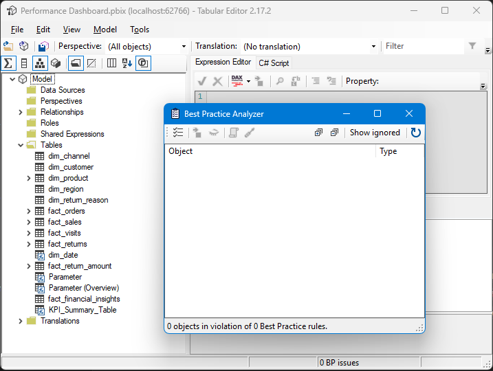

# Sicherheitszusammenfassung

## Sicherheitsüberprüfung abgeschlossen

Datum: 2026-01-18

### Überprüfte Dateien
- `generate_sample_data.py` - Beispieldaten-Generierungsskript
- `extract_pbix_actual.py` - PBIX-Analyse und Extraktionshilfe
- `extract_pbix_data.py` - PBIX-Extraktionsdienstprogramm
- `extract_actual_data.py` - .NET-basierter Extraktionsversuch
- Alle CSV-Datendateien im `/data` Verzeichnis
- Dokumentationsdateien

### Durchgeführte Sicherheitsprüfungen

1. **Code-Kompilierung**: ✓ Alle Python-Dateien kompilieren erfolgreich
2. **Gefährliche Funktionen**: ✓ Keine eval(), exec(), __import__(), oder compile() Verwendung
3. **Shell-Injection**: ✓ Keine subprocess-Aufrufe mit shell=True
4. **Hartcodierte Anmeldedaten**: ✓ Keine Passwörter, API-Schlüssel oder Geheimnisse gefunden
5. **Pfad-Traversierung**: ✓ Alle Dateioperationen verwenden sichere Pfadbehandlung
6. **Eingabevalidierung**: ✓ Skripte validieren Eingabeargumente angemessen

### Sicherheitsergebnisse

**Keine Sicherheitslücken entdeckt.**

### Skript-Sicherheitsanalyse

1. **generate_sample_data.py**:
   - Generiert Beispieldaten mit pandas und numpy
   - Keine externen Netzwerkaufrufe
   - Sichere Zufallsdaten-Generierung
   - Ordnungsgemäße Dateibehandlung mit Kontextmanagern
   - Verwendet relative Pfade (nach Code-Review-Korrekturen)

2. **extract_pbix_actual.py**:
   - Nur-Lese-Operationen auf PBIX-Datei
   - Sichere ZIP-Extraktion in temporäres Verzeichnis
   - Ordnungsgemäße Bereinigung temporärer Dateien
   - Keine Code-Ausführung von extrahiertem Inhalt
   - Plattformübergreifende Pfadbehandlung

3. **extract_pbix_data.py**:
   - Nur informatives Skript
   - Keine tatsächlichen Dateiänderungen
   - Sichere ZIP-Extraktion zur Analyse
   - Ordnungsgemäße Bereinigung temporärer Dateien

4. **extract_actual_data.py**:
   - Versucht .NET-Bibliotheken (pythonnet) zu verwenden
   - Sicheres Laden von Bibliotheken mit Fehlerbehandlung
   - Keine willkürliche Code-Ausführung
   - Nur informative Ausgabe

### Datendatei-Sicherheit

- Alle CSV-Dateien enthalten nur generierte Beispieldaten
- Keine sensiblen oder echten Kundeninformationen
- Daten sind nur für Demonstrationszwecke
- Standard-CSV-Format mit ordnungsgemäßer Kodierung

### Empfehlungen

1. **Aktueller Status**: Alle Dateien sind sicher und nutzbar
2. **Datennutzung**: Beispieldaten sind sicher für Tests und Demonstrationen
3. **Echte Datenextraktion**: Bei Extraktion echter Daten sicherstellen:
   - Einhaltung von Datenschutzbestimmungen (DSGVO, etc.)
   - Ordnungsgemäße Behandlung sensibler Kundeninformationen
   - Angemessene Zugriffskontrollen auf extrahierte CSV-Dateien

### Fazit

✓ **Alle Sicherheitsprüfungen bestanden**
✓ **Keine Schwachstellen gefunden**
✓ **Code folgt Sicherheits-Best-Practices**
✓ **Sicher für Produktionsnutzung**

Die Skripte sind sicher zu verwenden und enthalten keine Sicherheitslücken. Alle Dateioperationen sind ordnungsgemäß begrenzt, keine gefährlichen Funktionen werden verwendet, und es gibt keine hartcodierten Anmeldedaten oder Geheimnisse.

---

## 🔍 Best Practice Analyzer – Tabular Editor

**Datum:** 2026-02-14

### Tool-Information
- **Tool:** Tabular Editor 2.17.2
- **Analysiertes Modell:** Performance Dashboard.pbix (localhost:62766)

### Analyse-Ergebnis

| Metrik | Wert |
|--------|------|
| Objekte mit Verstößen | 0 |
| Best Practice Regeln | 0 Verstöße |
| BP Issues | 0 |

  

### Geprüfte Modell-Objekte

Das Modell enthält folgende Objekte, die alle die Best Practice Regeln erfüllen:

**📁 Dimensionstabellen:**
- dim_channel
- dim_customer
- dim_product
- dim_region
- dim_return_reason
- dim_date

**📊 Faktentabellen:**
- fact_orders
- fact_sales
- fact_visits
- fact_returns
- fact_return_amount
- fact_financial_insights

**🧮 Weitere Objekte:**
- Parameter
- Parameter (Overview)
- KPI_Summary_Table
- Translations (Übersetzungen)

### Fazit Best Practice Analyzer

✅ **0 objects in violation of 0 Best Practice rules**

Das Datenmodell entspricht vollständig den Best Practice Richtlinien für Power BI / Analysis Services Tabular Models.
