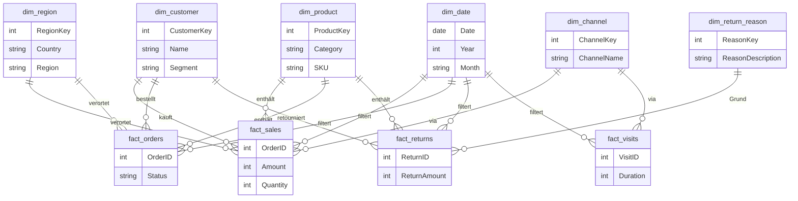

# Power BI Performance Dashboard - Datenmodell-Dokumentation

## Übersicht

Dieses Dokument beschreibt das Datenmodell (semantisches Modell) für das Power BI Performance Dashboard. Das Modell folgt einem **Sternschema**-Designmuster, optimiert für analytische Abfragen und Business Intelligence Reporting.

## Modell-Architektur

Das Datenmodell ist um Geschäftsprozesse herum organisiert mit klar getrennten **Faktentabellen** (enthält messbare Transaktionen) und **Dimensionstabellen** (enthält beschreibende Attribute).

### Sternschema-Design

```
                    dim_date
                        |
    dim_channel    dim_region    dim_customer    dim_product    dim_return_reason
         |              |              |              |              |
         +------+-------+------+-------+------+-------+------+-------+
                |                                                     |
         fact_visits  fact_sales  fact_orders              fact_returns
                                                                     |
                                                          fact_return_amount
                                  |
                      fact_financial_insights
```





## Faktentabellen

Faktentabellen enthalten die quantitativen Geschäftsdaten und Fremdschlüssel zu Dimensionstabellen.

### 1. fact_sales
**Zweck**: Verfolgt Verkaufstransaktionen und Umsatzkennzahlen

**Wichtige Kennzahlen**:
- Nettoumsatz
- Bruttoumsatz
- COGS (Wareneinsatz)
- Bruttogewinn
- Verkaufte Menge
- Umsatz pro Bestellung

**Granularität**: Eine Zeile pro Verkaufstransaktion

**Verbundene Dimensionen**: Kunde, Produkt, Datum, Region, Kanal

---

### 2. fact_orders
**Zweck**: Verfolgt Bestelllebenszyklus und operative Kennzahlen

**Wichtige Kennzahlen**:
- Gesamtbestellungen
- Bestellstatus (Abgeschlossen, Storniert)
- Durchschnittlicher Bestellwert (AOV)
- Bestellabschlussrate
- Bestellstornierungsrate
- Pünktliche Lieferperformance
- Lieferzeit

**Granularität**: Eine Zeile pro Bestellung

**Verbundene Dimensionen**: Kunde, Produkt, Datum, Region, Kanal

---

### 3. fact_returns
**Zweck**: Verfolgt Produktrücksendungen und Rücksendeverhalten

**Wichtige Kennzahlen**:
- Rücksendevolumen
- Rücksendequote
- Rücksendewert
- Rücksende-Bearbeitungsstatus

**Granularität**: Eine Zeile pro Rücksende-Transaktion

**Verbundene Dimensionen**: Kunde, Produkt, Datum, Region, Rücksende-Grund

---

### 4. fact_visits
**Zweck**: Verfolgt Kundenengagement und Website-/Ladenbesuche

**Wichtige Kennzahlen**:
- Besuchsanzahl
- Kundenengagement-Kennzahlen

**Granularität**: Eine Zeile pro Kundenbesuch

**Verbundene Dimensionen**: Kunde, Datum, Kanal

---

### 5. fact_return_amount
**Zweck**: Aggregierte Rücksendewerte und finanzielle Auswirkungen

**Wichtige Kennzahlen**:
- Gesamter Rücksendewert
- Rücksendewert nach Kategorie

**Granularität**: Aggregierte Rücksendewerte

**Verbundene Dimensionen**: Datum, Produkt, Kunde

---

### 6. fact_financial_insights
**Zweck**: Finanzzusammenfassung und Performance-Indikatoren

**Wichtige Kennzahlen**:
- Finanz-KPIs
- Rentabilitätskennzahlen
- Umsatzanalyse

**Granularität**: Aggregierte Finanzdaten

**Verbundene Dimensionen**: Datum, Kunde, Produkt

---

## Dimensionstabellen

Dimensionstabellen bieten beschreibenden Kontext für die Analyse von Fakten.

### 1. dim_customer
**Zweck**: Kundenstammdaten und Attribute

**Wichtige Attribute**:
- Kunden-ID
- Kundenname
- Kundentyp (B2B / B2C)
- Kundenpriorität/Segment
- Kundenloyalitätsstatus
- Geografische Lage

**Typ**: Slowly Changing Dimension (SCD)

---

### 2. dim_product
**Zweck**: Produkthierarchie und Klassifizierungen

**Wichtige Attribute**:
- Produkt-ID / SKU
- Produktname
- Kategorie
- Unterkategorie
- Marke
- Produktattribute

**Hierarchie**: Marke → Kategorie → Unterkategorie → SKU

---

### 3. dim_region
**Zweck**: Geografische Hierarchie für standortbasierte Analysen

**Wichtige Attribute**:
- Regions-ID
- Regionsname (Amerika, Europa, Asien)
- Land
- Stadt
- Geografische Koordinaten (für Kartenvisualisierungen)

**Hierarchie**: Region → Land → Stadt

---

### 4. dim_date
**Zweck**: Time Intelligence und datumsbasierte Filterung

**Wichtige Attribute**:
- Datum
- Jahr
- Quartal
- Monat
- Monatsname
- Woche
- Tag
- Wochentag
- Ist Wochenende
- Geschäftsperiode

**Typ**: Datumsdimension mit kontinuierlichem Datumsbereich

**Besondere Funktionen**:
- Unterstützt Vorjahresvergleiche (YoY)
- Vorjahresberechnungen
- Monat-über-Monat-Trends

---

### 5. dim_channel
**Zweck**: Klassifizierung von Verkaufs- und Vertriebskanälen

**Wichtige Attribute**:
- Kanal-ID
- Kanalname
- Kanaltyp
- Kanalkategorie

**Beispiele**: Online, Einzelhandel, Großhandel, Partner

---

### 6. dim_return_reason
**Zweck**: Klassifizierung von Rücksendegründen für Qualitätsanalysen

**Wichtige Attribute**:
- Grund-ID
- Grundcode
- Grundbeschreibung
- Grundkategorie

**Beispiele**: Defekt, Falscher Artikel, Nicht wie beschrieben, Kunde hat Meinung geändert

---

## Unterstützende Tabellen

### KPI_Summary_Table
**Zweck**: Vorberechnete KPI-Zusammenfassungswerte zur Dashboard-Performance-Optimierung

**Inhalt**:
- Kern-Geschäfts-KPIs
- Aggregierte Kennzahlen
- Vergleichswerte (Aktuell vs. Vorperiode)

---

### Parametertabellen

#### Parameter
**Zweck**: Vom Benutzer ausgewählte Parameter für dynamisches Filtern und Berechnungen

#### Parameter (Übersicht)
**Zweck**: Parameter speziell für die Übersichts-Dashboard-Seite

---

## Beziehungen

Das Modell verwendet Standard-**Sternschema-Beziehungen**:

- **Eins-zu-Viele**-Beziehungen von Dimensionen zu Fakten
- **Kardinalität**: Dimension (1) → Fakt (Viele)
- **Kreuzfilter-Richtung**: Einzelne Richtung (von Dimension zu Fakt) für die meisten Beziehungen
- **Referenzielle Integrität**: Durchgesetzt über Power BI-Beziehungen

### Hauptbeziehungen:

1. **dim_date** → Mehrere Faktentabellen (Sales, Orders, Returns, Visits)
2. **dim_customer** → fact_sales, fact_orders, fact_returns, fact_visits
3. **dim_product** → fact_sales, fact_orders, fact_returns
4. **dim_region** → fact_sales, fact_orders, fact_returns
5. **dim_channel** → fact_sales, fact_orders, fact_visits
6. **dim_return_reason** → fact_returns
7. **fact_returns** → fact_return_amount (Aggregationsbeziehung)

---

## DAX-Measures und Berechnungen

Das Modell enthält umfangreiche DAX (Data Analysis Expressions) Berechnungen für:

### Time Intelligence
- Aktuelles Jahr (CY) Kennzahlen
- Vorjahr (PY) Kennzahlen
- Vorjahresvergleiche (YoY)
- YoY Wachstum %
- Monat-über-Monat-Trends

### Kundenanalysen
- Neukunden
- Wiederkehrende Kunden
- Kundenbindungsrate
- Customer Lifetime Value

### Verkaufskennzahlen
- Nettoumsatz = Bruttoumsatz - Rücksendungen
- Bruttogewinn = Umsatz - Wareneinsatz
- Bruttogewinnmarge %
- Durchschnittlicher Umsatz pro Bestellung

### Bestellkennzahlen
- Bestellabschlussrate
- Bestellstornierungsrate
- Durchschnittlicher Bestellwert (AOV)

### Rücksendekennzahlen
- Rücksendequote = Rücksendungen / Gesamtbestellungen
- Rücksendewert-Auswirkung

---

## Datenmodell-Eigenschaften

### Format
- **Modelltyp**: Tabellarisch (Analysis Services)
- **Kompatibilitätslevel**: 1520 oder höher
- **Komprimierung**: XPress9 (VertiPaq)
- **Speichermodus**: Import

### Performance-Optimierungen
- **Sternschema**: Optimiert für Abfrageleistung
- **Voraggregierte Tabellen**: KPI_Summary_Table für schnelles Dashboard-Laden
- **Beziehungen**: Ordnungsgemäß indiziert für effiziente Joins
- **Datentypen**: Optimierte Spaltendatentypen
- **Hierarchien**: Definiert für Drill-down-Analysen

---

## Verwendungskontext

Dieses Datenmodell unterstützt die folgenden Dashboard-Seiten:

1. **Übersicht**: Geschäftsüberblick auf hoher Ebene mit Kern-KPIs
2. **Verkaufsanalyse**: Umsatz und finanzielle Performance
3. **Kundenanalyse**: Kundenverhalten und Retention
4. **Bestellanalyse**: Operative Effizienz
5. **Rücksendungsanalyse**: Produktqualität und Rücksendungsmuster

---

## Datenquellen

Basierend auf der Modellstruktur werden die Daten geladen aus:
- Transaktionssystemen (Verkäufe, Bestellungen, Rücksendungen)
- Kundenbeziehungsmanagement-System (CRM)
- Produktkatalog
- Geografischen Referenzdaten
- Datums-/Kalendertabelle (generiert)

---

## Modelldatei

Die vollständige Modelldefinition ist gespeichert in:
- **Datei**: `Model.bim` (im Repository-Hauptverzeichnis)
- **Format**: Binär (XPress9-komprimiertes Tabular Model)
- **Quelle**: Extrahiert aus `Performance Dashboard.pbix`

### Anzeigen des Modells

Um die vollständige Modellstruktur anzuzeigen:

1. **Mit Power BI Desktop**:
   - Öffnen Sie `Performance Dashboard.pbix`
   - Gehen Sie zur Modellansicht
   - Zeigen Sie Tabellen, Beziehungen und Measures an

2. **Mit Tabular Editor** (empfohlen für erweiterte Modellanalyse):
   - Laden Sie [Tabular Editor](https://tabulareditor.com/) herunter
   - Datei → Öffnen → Von Datenbank (Verbindung zur PBIX)
   - oder extrahieren und öffnen Sie Model.bim mit Dekomprimierungstools

3. **Mit DAX Studio** (für Measure-Analyse):
   - Laden Sie [DAX Studio](https://daxstudio.org/) herunter
   - Verbinden Sie sich mit der PBIX-Datei
   - Analysieren Sie Measures und Performance

---

## Angewandte Best Practices

✅ **Sternschema-Design**: Klare Trennung von Fakten und Dimensionen  
✅ **Namenskonventionen**: Konsistente `fact_` und `dim_` Präfixe  
✅ **Datumsdimension**: Umfassende Datumstabelle für Time Intelligence  
✅ **Optimierte Beziehungen**: Eins-zu-Viele, einzelne Richtung  
✅ **Measure-Organisation**: DAX-Measures logisch gruppiert  
✅ **Datentypen**: Geeignete Datentypen für Performance  
✅ **Hierarchien**: Vordefiniert für häufige Drill-downs  

---

## Modellwartung

### Aktualisierungsstrategie
- **Vollständige Aktualisierung**: Aktualisiert alle Tabellen mit neuesten Daten
- **Inkrementelle Aktualisierung**: Kann für große Faktentabellen konfiguriert werden
- **Aktualisierungshäufigkeit**: Abhängig von Geschäftsanforderungen (täglich, wöchentlich, etc.)

### Versionskontrolle
- Modelländerungen sollten dokumentiert werden
- Verwenden Sie Tabular Editor für Versionskontrolle von Modell-Metadaten
- Exportieren Sie Model.bim für Backup und Vergleich

---

## Zusätzliche Ressourcen

- [Power BI Data Modeling Best Practices](https://docs.microsoft.com/en-us/power-bi/guidance/star-schema)
- [DAX Reference](https://dax.guide/)
- [Tabular Editor Documentation](https://docs.tabulareditor.com/)

---

*Zuletzt aktualisiert: Januar 2026*  
*Modellversion: Kompatibel mit der Performance Dashboard PBIX-Datei*
